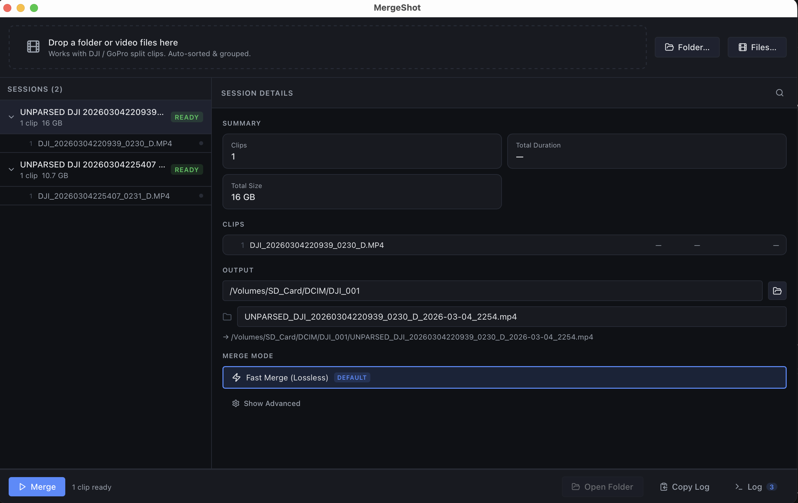

# MergeShot

Merge split camera recordings (DJI, GoPro) into one file — lossless, instant, no command line.

## Download

Go to [Releases](../../releases) and download the installer for your platform:

- **macOS** — `.dmg`
- **Windows** — `.exe`

## Install

**macOS:** Open the `.dmg`, drag MergeShot to Applications. On first launch, right-click the app and choose Open (required once to bypass Gatekeeper).

**Windows:** Run the `.exe` installer. If Windows Defender shows a warning, click "More info" then "Run anyway".

## How it works

1. Drop your video folder into the app (or click **Folder...**).
2. MergeShot groups your clips into sessions automatically.
3. Pick an output folder, then click **Merge**.

That's it. Your clips are joined into a single file without re-encoding — no quality loss, no waiting.

---

For developer docs, build instructions, and project architecture see [docs/DEVELOPER.md](docs/DEVELOPER.md).
